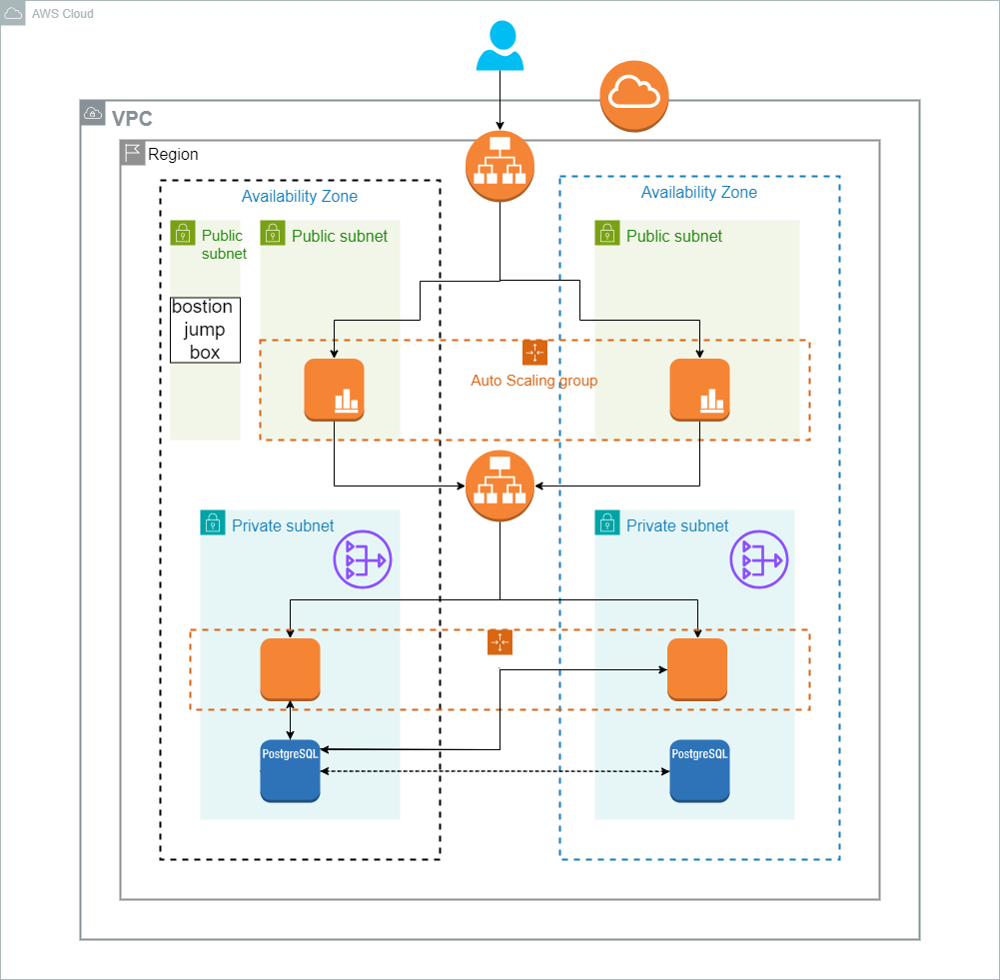

# AWS 3-Tier Architecture infrastructure with Terraform

## Overview

This Terraform project deploys a highly-scalable and secure 3-tier architecture on AWS. The architecture consists of an External Application Load Balancer (ALB), Nginx web servers in the presentation tier, Dockerized instances in the application tier, and an RDS database in the data tier.

## Architecture Components


### External ALB (Application Load Balancer):

- Serves as the entry point for customer requests.
- Routes traffic to the auto-scaling group of Nginx web servers in the presentation tier.

### Presentation Tier (Nginx Web Servers):

- Receives customer queries from the external ALB.
- Utilizes auto-scaling to handle varying loads.
- Communicates internally with the application tier through the Internal ALB.

### Internal ALB (Application Load Balancer):

- Acts as the interface between the presentation and application tiers.
- Routes requests from the presentation tier to the auto-scaling group of application instances.


### RDS Database (Data Tier):

- Stores and manages persistent data for the application.
- Isolated from external access, only accessible by the application tier instances.
- Enhances security by restricting direct access from the presentation tier.

### Bostion Host User / Jump Box
1. Access the Bastion Host using SSH:
```bash
   ssh -i path/to/your-key.pem ec2-user@bastion-ip

```

## Security Measures

### Security Groups:

- Each tier is secured using AWS Security Groups.
- Presentation tier instances can only communicate with the external ALB.
- Application tier instances can communicate internally via the Internal ALB and have access to the RDS database.
- RDS database only accepts connections from the application tier.

### Internal Communication:

- Communication between tiers is controlled and secured, reducing the attack surface.
- External access to critical components like the database is restricted.


## Scalability

### Auto-scaling:

- Both the presentation and application tiers employ auto-scaling.
- Automatically adjusts the number of instances based on demand, ensuring optimal performance and resource utilization.

## Conclusion
This Terraform project adheres to best practices for security, scalability, and maintainability on AWS. It provides a bastion host for secure access, effectively separates concerns between tiers, encapsulates the application in containers, and leverages AWS services for enhanced performance and reliability.
